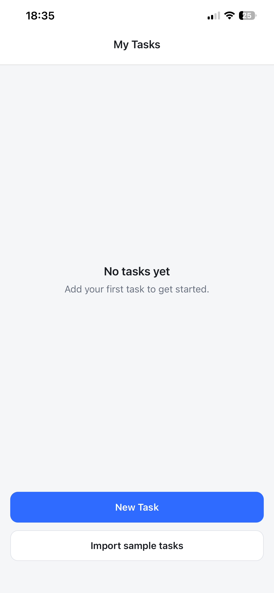
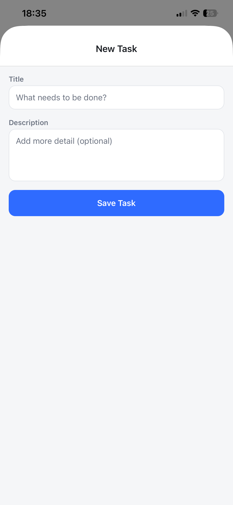
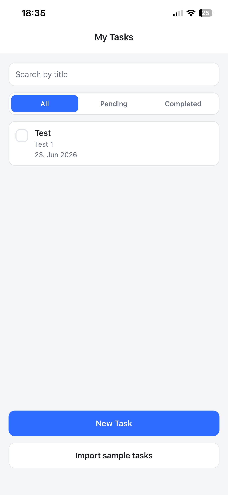
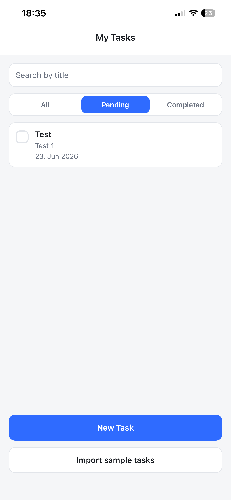
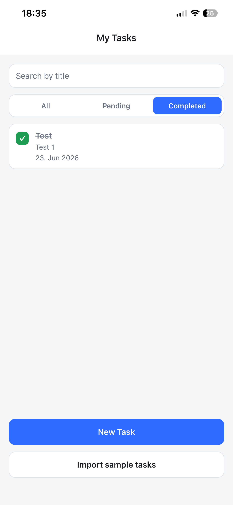
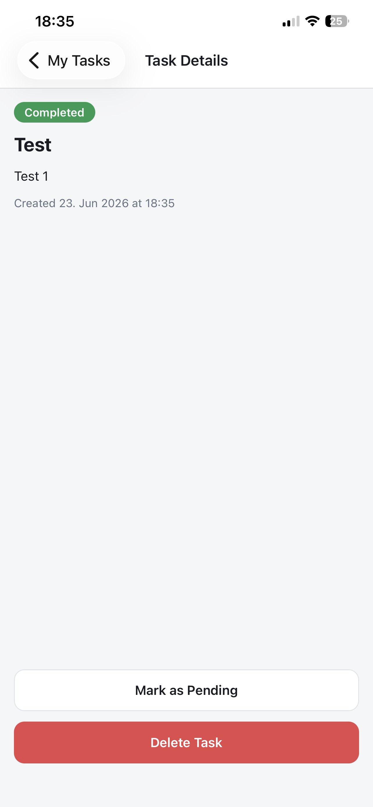

# Task Management System

## Features

- **Task list** with empty state and pull-to-refresh-free instant updates.
- **Add task** with title + description and input validation.
- **Task details** view with full description and created date.
- **Mark complete / not complete** from the list or the details screen.
- **Delete task** with a confirmation dialog.
- **Search** tasks by title.
- **Filter** tasks by status (all / pending / completed).
- **Local persistence** via AsyncStorage — tasks survive app restarts.
- **Public API import** — pull sample tasks from the DummyJSON Todos API.

## Tech Stack

- Expo SDK 54, React Native 0.81, React 19
- TypeScript, functional components, hooks
- expo-router (file-based navigation)
- @react-native-async-storage/async-storage

## Getting Started

### Prerequisites

- Node.js 18+
- The Expo Go app on your phone, or an Android/iOS emulator

### Install

```sh
npm install
```

### Run

```sh
npm start
```
Then scan the QR code with Expo Go (iOS Camera / Expo Go on Android), or press
`a` for Android emulator / `i` for iOS simulator.

```sh
npm run android
npm run ios
```

If you have problem to run the project because internet connection, try these:

npx expo start --tunnel

or

npx expo start --offline

## Public API

The app fetches sample todos from
[`https://dummyjson.com/todos`](https://dummyjson.com/todos) and maps each item
onto the local task model. Tap **Import sample tasks** on the list screen to load
them. Loading and error states are handled in the UI.

## Screenshots
**Home screen**:


**Add Task**:


**Added Task**:




**Task Details**:

